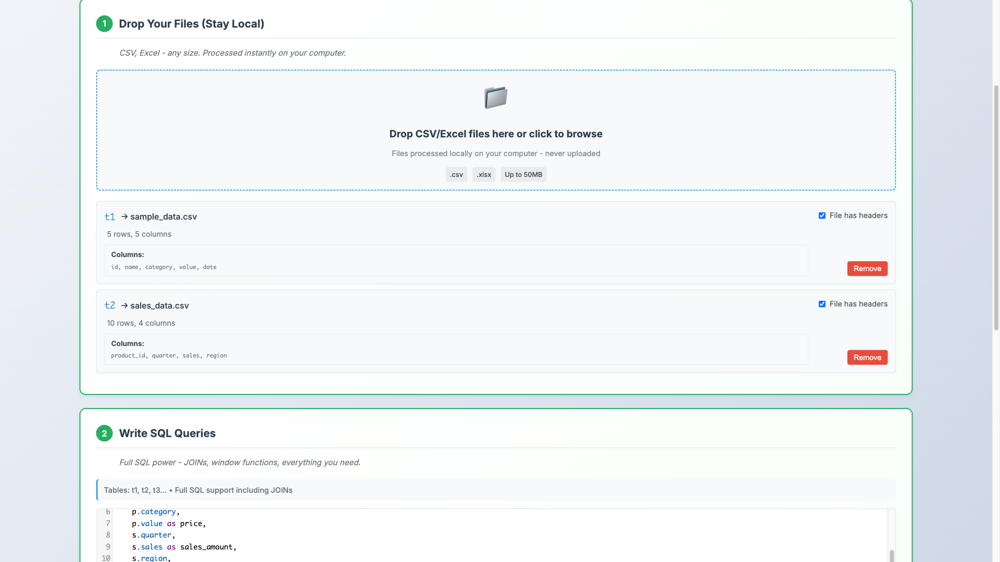
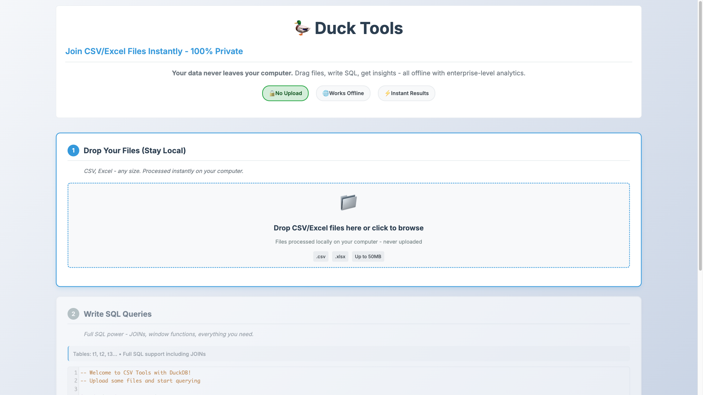

# 🦆 Duck Tools - SQL Analytics for CSV/Excel Files

> **🔒 100% Private • 🌐 Works Offline • 💪 Join Files Instantly**  
> Powerful client-side data analysis tool that lets you join, query, and analyze CSV/Excel files using full SQL syntax - **your data never leaves your computer!**

[](https://jim-my.github.io/duck-tools/)
[](#)
[](#)
[](#)
[](#)

**➡️ Live Site: [https://jim-my.github.io/duck-tools/](https://jim-my.github.io/duck-tools/)**



## 🔐 Why Duck Tools? (Privacy + Power)

### **🚫 No Data Upload = Zero Security Risk**
- Your sensitive data **never leaves your computer**
- No cloud servers, no data breaches, no privacy concerns
- Perfect for confidential business data, personal finances, or sensitive research

### **🌐 Works Completely Offline**
- No internet connection required after initial page load
- Perfect for air-gapped environments or restricted networks  
- Analyze data anywhere - plane, train, or secure facility

### **💪 Modern SQL Engine (DuckDB)**
- **Latest SQL features**: Window functions, CTEs, JSON processing, regex
- **PostgreSQL compatibility**: Use familiar SQL syntax and functions  
- **Analytics powerhouse**: Built for data analysis, not just storage
- **Zero setup**: Enterprise database features without the enterprise complexity


*↗️ Drag two CSV files, write one SQL query, get instant insights - all without uploading anything!*

## ✨ Features

### 🚀 **Instant File Processing**
- **Drag & drop** CSV and Excel files (.xlsx, .csv)
- **Automatic table creation** with smart aliasing (t1, t2, t3...)
- **Real-time file validation** and error handling
- **Header detection** with toggle option for CSV files

### 💪 **Full SQL Power**
- **Complete DuckDB SQL engine** running in your browser
- **Syntax highlighting** with CodeMirror editor
- **JOINs, aggregations, window functions** - everything you need
- **Query examples** to get you started quickly

### 📊 **Smart Results Display**
- **Responsive table** with smooth scrolling
- **Export to CSV** with one click
- **Performance optimized** for large datasets
- **Real-time query statistics**

### 🔒 **Privacy & Security**
- **100% client-side processing** - your data never leaves your computer
- **No server required** - works completely offline
- **No data collection** - total privacy guaranteed

## 🎯 Quick Start - Join Files in 30 Seconds!

### 1. **Open the App** 
Simply open `index.html` in any modern browser - **no installation, no signup, no data upload!**

### 2. **Drop Multiple Files**



Drag and drop **multiple** CSV or Excel files. Each file instantly becomes a table (t1, t2, t3...) - **all processing happens locally!**

### 3. **Write JOIN Queries**


**This is where the magic happens!** Write SQL to join your files - something that normally requires a database setup:

```sql
-- 🚀 JOIN TWO FILES INSTANTLY!
SELECT 
    p.name as product_name,
    p.category,
    s.sales as sales_amount,
    s.region
FROM t1 p
JOIN t2 s ON p.id = s.product_id
ORDER BY s.sales DESC;
```

### 4. **Get Instant Results**


**Boom!** Your files are joined and analyzed - **all without uploading a single byte to any server!**

### 5. **Export & Share**
Download your results as CSV. Share the insights, not the sensitive data.

## 📖 Use Cases

### 🔍 **Data Analysis**
```sql
-- Find top-selling products by category
SELECT category, name, SUM(sales) as total_sales
FROM products p
JOIN sales s ON p.id = s.product_id
GROUP BY category, name
ORDER BY total_sales DESC
LIMIT 10;
```

### 📈 **Business Intelligence**
```sql
-- Calculate customer lifetime value
SELECT 
    customer_id,
    COUNT(*) as orders,
    SUM(amount) as total_spent,
    AVG(amount) as avg_order_value,
    MAX(order_date) as last_order
FROM orders
GROUP BY customer_id
HAVING total_spent > 1000
ORDER BY total_spent DESC;
```

### 🔗 **Data Joining**
```sql
-- Combine data from multiple sources
SELECT 
    u.name,
    u.email,
    p.plan_name,
    COUNT(o.id) as order_count,
    SUM(o.amount) as revenue
FROM users u
LEFT JOIN plans p ON u.plan_id = p.id
LEFT JOIN orders o ON u.id = o.customer_id
GROUP BY u.name, u.email, p.plan_name
ORDER BY revenue DESC;
```

## 🛠️ Development

### Running Locally
```bash
# Serve the files (any static server works)
python -m http.server 8000
# or
npx serve .
```

### Taking Screenshots (Automated)
```bash
# Update all screenshots automatically (works anywhere!)
just screenshots

# Run tests with browser automation
just test

# Serve locally from project directory
just serve
```

**🎯 Fully Portable**: The automation uses `{{justfile_directory()}}` so it works immediately after cloning - no path configuration needed!

### Project Structure
```
duck-tools/
├── index.html              # Main application
├── css/
│   └── style.css           # Styling
├── js/
│   ├── main.js            # Application coordinator
│   ├── duckdb-manager.js  # Database operations
│   ├── file-handler.js    # File processing
│   ├── sql-editor.js      # SQL editor component
│   ├── results-table.js   # Results display
│   └── csv-exporter.js    # Export functionality
├── tests/
│   ├── test.html          # Test runner
│   └── *.js               # Test suites
├── demo/                  # Sample data files
└── screenshots/           # Documentation images
```

## 🧪 Testing

```bash
# Run all tests
just test

# Run specific test suite
open tests/test.html
```

## 🚀 Advanced Features

### **Excel Multi-Sheet Support**
- Automatically detects multiple sheets
- Load specific sheets on demand
- Switch between sheets seamlessly

### **Performance Optimization**
- **Virtual scrolling** for large datasets
- **Web Workers** for file processing
- **Memory management** for long sessions

### **Error Recovery**
- **Intelligent error messages** with suggestions
- **Automatic retry** for transient failures
- **Graceful degradation** when features unavailable

## 🎨 Customization

### **Themes**
The CSS uses CSS custom properties for easy theming:

```css
:root {
    --primary-color: #2563eb;
    --success-color: #10b981;
    --error-color: #ef4444;
    /* ... customize colors ... */
}
```

### **SQL Examples**
Add your own example queries in `js/sql-editor.js`:

```javascript
const customExamples = [
    {
        name: "My Custom Query",
        sql: "SELECT * FROM my_table WHERE condition = 'value'"
    }
];
```

## 🛡️ Privacy & Security Comparison

| Feature | Duck Tools | Cloud Analytics | Traditional Database |
|---------|------------|-----------------|---------------------|
| **Data Upload** | ❌ Never | ✅ Always | ✅ Required |
| **Internet Required** | ❌ No (after load) | ✅ Always | ✅ For setup |
| **Data Breach Risk** | ❌ Zero | ⚠️ High | ⚠️ Medium |
| **Compliance Issues** | ❌ None | ⚠️ Many | ⚠️ Some |
| **Setup Time** | ⚡ 0 seconds | ⏱️ Hours | ⏱️ Days |
| **Cost** | 💰 Free | 💰💰 $/month | 💰💰💰 $$ |
| **SQL Features** | ✅ Modern | ⚠️ Limited | ✅ Full |
| **File Joining** | ✅ Instant | ✅ Yes | ✅ Yes |

**🎯 Perfect for:**
- Financial analysts working with sensitive data
- Healthcare researchers with patient information  
- Government agencies with classified data
- Consultants analyzing client confidential information
- Anyone who values data privacy and security

## 🔧 Browser Compatibility

| Browser | Support | Notes |
|---------|---------|-------|
| Chrome 90+ | ✅ Full | Recommended |
| Firefox 88+ | ✅ Full | WebAssembly support |
| Safari 14+ | ✅ Full | Modern WebKit |
| Edge 90+ | ✅ Full | Chromium-based |

## 💡 Tips & Tricks

### **File Naming**
- Use descriptive filenames - they become your table identifiers
- `sales_2024.csv` → accessible as `sales_2024` table
- Spaces in filenames are converted to underscores

### **Performance**
- For large files (>5MB), consider splitting into smaller chunks
- Use `LIMIT` in your queries while exploring data
- Export uses the full dataset regardless of display limits

### **Modern SQL Features** 
Duck Tools supports cutting-edge SQL features that rival expensive enterprise databases:

```sql
-- 🪟 Window Functions
SELECT 
    customer_id,
    order_date,
    amount,
    SUM(amount) OVER (PARTITION BY customer_id ORDER BY order_date) as running_total,
    LAG(amount, 1) OVER (PARTITION BY customer_id ORDER BY order_date) as prev_order
FROM orders;

-- 📊 Common Table Expressions (CTEs)
WITH monthly_sales AS (
    SELECT 
        DATE_TRUNC('month', order_date) as month,
        SUM(amount) as total
    FROM orders
    GROUP BY month
)
SELECT month, total, total - LAG(total) OVER (ORDER BY month) as growth
FROM monthly_sales;

-- 🔍 Advanced Analytics
SELECT 
    product_name,
    category,
    PERCENTILE_CONT(0.5) WITHIN GROUP (ORDER BY price) as median_price,
    STDDEV(price) as price_volatility,
    CORR(price, sales_volume) as price_sales_correlation
FROM products 
GROUP BY product_name, category;

-- 📅 Date/Time Magic
SELECT 
    customer_id,
    DATE_DIFF('day', first_order, last_order) as customer_lifespan_days,
    DATE_PART('quarter', order_date) as quarter,
    DATE_FORMAT(order_date, '%Y-%m') as year_month
FROM customer_orders;
```

## 🐛 Troubleshooting

### **File Won't Load**
1. Check file format (CSV/XLSX only)
2. Verify file isn't corrupted
3. Try converting to CSV if Excel file fails

### **Query Errors**
1. Check table names (t1, t2, t3...)
2. Verify column names match your data
3. Use `DESCRIBE t1` to see table structure

### **Performance Issues**
1. Use `LIMIT` for large result sets
2. Add appropriate `WHERE` clauses
3. Consider indexing for repeated queries

## 📚 Resources

- **DuckDB Documentation**: [duckdb.org/docs](https://duckdb.org/docs/)
- **SQL Tutorial**: [W3Schools SQL](https://www.w3schools.com/sql/)
- **Sample Datasets**: Check the `demo/` folder

## 🤝 Contributing

1. Fork the repository
2. Create a feature branch
3. Make your changes
4. Run the tests: `just test`
5. Update screenshots: `just screenshots`
6. Submit a pull request

## 📄 License

MIT License - feel free to use this in your own projects!

---

**Made with ❤️ for data analysts who value privacy and performance**

*No servers, no tracking, no limits - just pure SQL power in your browser!*

